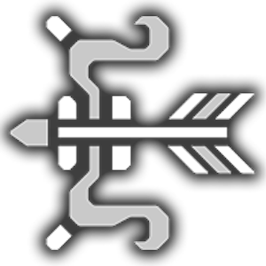

Bow is a simple weapon to learn: aim, shoot, loop maximum charge level.
It's very much like riding a bike in that you keep pedaling to keep pace.

## Player Skill

The deciding factor for competency is whether you can Dodgebolt successfully and consistently. 

## Mechanics

Bow's damage output is mostly determined on a spreadsheet much like the other two ranged weapon options.
Unlike playing the other two ranged options, you need to be able to react accordingly to monster attacks.
Dodgebolt.

### Charge Levels

For each bow has up to 4 charge levels. Each charge level could have a different shot type and shot level.

Charge levels are damage multipliers themselves: higher level, more damage.

### Shot Types

### Shot Levels

## Optimal Combos

### Plain Link Embed

Example of plain link detection:

https://www.youtube.com/watch?v=kk_zmiREuZk

### Advanced Link Embed

Example of same video with advanced embedding customizations:

import { YouTube } from 'astro-embed';

<YouTube
    id="kk_zmiREuZk"
    poster="https://cdn.wccftech.com/wp-content/uploads/2022/03/WCCFmonsterhunterrise7.jpg"
    posterQuality="max"
    params="start=1556"
    playlabel="Video Abspielen"
    title="I don't ever want to see any of you play like this."
/>

## Utilities

## Switch Skills

## Advanced

## Closing Thoughts

